# Kennismaking met de Micro:bit

*Je gaat kennismaken met een website waarop je kunt leren programmeren voor een Micro:bit. Je begint met het maken van een programma waardoor je naam op de Micro:bit verschijnt. Je leert ook hoe je het programma kunt opslaan en op de Micro:bit kunt zetten.*

### Inhoud

```@contents
Pages = ["chapter1.md"]
```

## Wat je nodig hebt

- [BBC Micro:bit – Go:Bundle V2](https://elektronicavoorjou.nl/product/bbc-microbit-gobundle-v2/)
- Mico USB aan Standaard USB kabel (is onderdeel van de bovenvermelde kit)
- Laptop met een moderne browser met een standaard USB aansluiting (Chrome, Firefox, Safari)

## Wat je gaat doen

Stap 1: Micro:bit aansluiten op je laptop.

Stap 2: Naar de "MakeCode" site voor de Micro:bit.

Stap 3: Je naam tonen op het LED-display.

Stap 4: Code op je laptop bewaren.

Stap 5: Code naar de Micro:bit overzetten.

Stap 6: Micro:bit gebruikershandleiding.

## Stap 1 - Micro:bit aansluiten op je laptop

1. Pak de USB-kabel die bij de Micro:bit hoort. Het heeft aan het ene uiteinde een Micro-USB-aansluiting en aan het andere uiteinde een standaard USB-aansluiting. ``\\``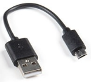
2. Steek het Micro-USB-uiteinde van de kabel in de Micro:bit. Dit is het kleine aansluitpunt op de bovenkant van de Micro:bit. ``\\``
3. Steek het standaard USB-uiteinde van de kabel in een USB-poort op je laptop. Dit is een kleine rechthoekige opening waar de kabel in past.

Als je alles goed hebt aangesloten, zou je Micro:bit nu op je laptop moeten verschijnen als een opslagapparaat. Dit betekent dat je bestanden kunt overzetten naar de Micro:bit of nieuwe programma's kunt uploaden.

## Stap 2 - Naar de "MakeCode" site voor de Micro:bit

1. Ga naar de MakeCode website voor micro:bit: [https://makecode.microbit.org/](https://makecode.microbit.org/)
2. Klik op het vlak "Nieuw project". ``\\``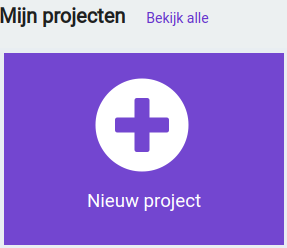
3. Geef het project de naam: "Mijn naam" ``\\``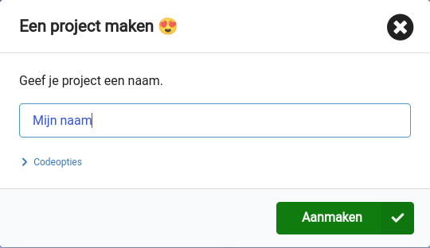
4. Druk op de toets: "Aanmaken". Je komt in je werkomgeving. ``\\``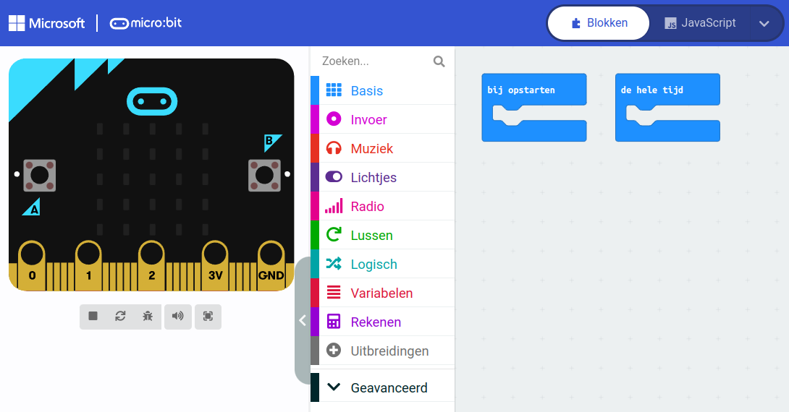

De micro:bit is een klein apparaatje dat je kunt programmeren om verschillende dingen te doen. Wanneer je de micro:bit aansluit op je computer en naar de "MakeCode voor de micro:bit" website gaat, zie je aan de linkerkant de micro:bit zelf. Daarnaast zie je een menu met allemaal blokken die je kunt gebruiken om de micro:bit te programmeren. Je krijgt de blokken te zien zodra je op een van de categorieën klikt.

In het werkvlak, dat is het grote grijze vlak aan de rechterkant, kun je deze blokken naartoe slepen om een programma te maken. Er staan al twee soorten blokken: "bij opstarten" en "de hele tijd".

"Bij opstarten" is een blok dat één keer worden uitgevoerd zodra je de micro:bit aanzet. Bijvoorbeeld, je kunt instellen dat de micro:bit een boodschap laat zien wanneer hij wordt aangezet.

"De hele tijd" is een blok dat continu wordt uitgevoerd zolang de micro:bit aan staat. Hiermee kun je bijvoorbeeld instellen dat de micro:bit een lichtje laat knipperen, een geluidje laat horen of je naam laat zien op het display.

Met deze blokken kun je de micro:bit dus heel precies programmeren en allerlei leuke dingen maken.

## Stap 3 - Je naam tonen op het LED-display

|Stap        | Actie      |
|:---------- | :---------- |
| 1 | Klik in het menu op de categorie "Basis". Als je een computerprogramma maakt en je wilt de basisblokken zien die je kunt gebruiken, moet je in het menu op de categorie "Basis" klikken. Dan worden alle blokken getoond die onder "Basis" vallen. Dit helpt je om de juiste blokken te vinden die je nodig hebt om het programma te maken. ``\\``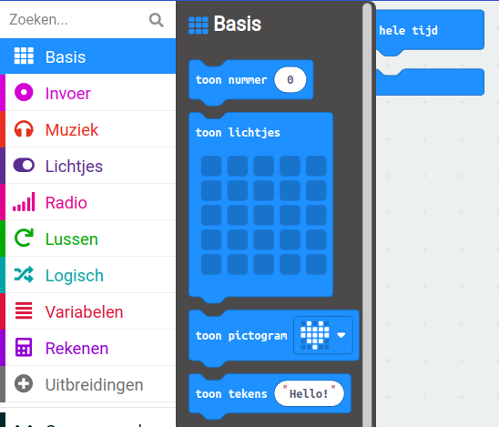 |
| 2 | Je kunt het blok "toon tekens" gebruiken om tekst op de Micro:bit weer te geven. Om dit te doen, moet je het "toon tekens" blok naar het "de hele tijd" blok slepen op je werkblad. Op deze manier kan het programma de tekst continu op het scherm weergeven. ``\\``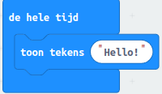 |
| 3 | Kijk eens naar de Micro:bit op je scherm. Zie je de letters "Hallo!"? Ze verschijnen één voor één op de Micro:bit. ``\\``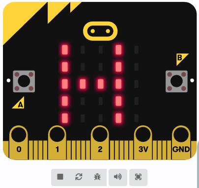 |
| 4 | Als je wilt dat het jouw naam weergeeft in plaats van "Hello!", moet je op het blok op je werkblad klikken waar "Hello!" staat. Vervolgens kun je je eigen naam typen, zoals bijvoorbeeld "Rob" als dat jouw naam is. Op deze manier zal het programma jouw naam weergeven in plaats van "Hello!" wanneer het wordt uitgevoerd. ``\\``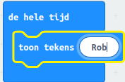 
| 5 | Kijk eens naar de knopjes onder de Micro:bit. Als je er met je muis overheen gaat, zie je wat ze doen. Het eerste knopje stopt de simulatie. Weet jij wat de andere knopjes doen? ``\\``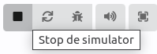 |
||

Knopjes onder de Micro:bit:

| Knop        | Actie      |
|:---------- | :---------- |
| 1ste | Stop de simulator. |
| 2de | Herstart de simulator. |
| 3de | Debug modus in-/uischakelen. Met deze knop kun je  controleren of het computerprogramma werkt zoals het hoort. Als je op deze knop drukt, zal het volgende blok oplichten en zal de code die bij dat blok hoort worden uitgevoerd. Dit helpt je om eventuele fouten in het programma op te sporen en op te lossen. |
| 4de | Geluid dempen. |
| 5de | Start in volledig scherm. |

## Stap 4 - Code op je laptop bewaren

Elke laptop is anders, dus de stappen die je moet volgen zijn ook anders. Ik ga je laten zien hoe het op mijn laptop moet.

|Stap        | Actie       |
|:---------- | :---------- |
| 1 | Maak een nieuw mapje genaamd "Micro:bit" in de map Downloads. ``\\``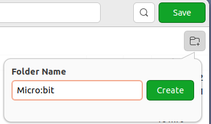 |
| 2 | Druk op de knop die "Create" heet. Het kan zijn dat deze knop op jouw computer een andere naam heeft! |
| 3 | Klik op de knop "Save" om het bestand "microbit-Mijn-naam.hex" te bewaren. ``\\``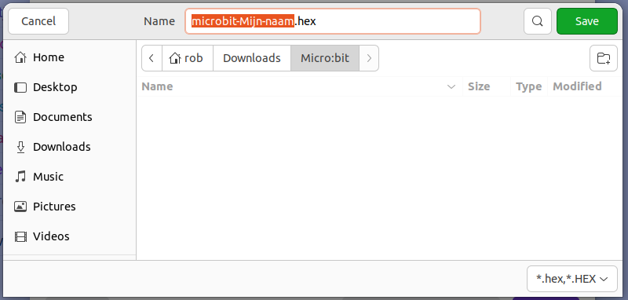
||

## Stap 5 - Code naar de Micro:bit overzetten

Elke laptop is anders, dus de stappen die je moet volgen zijn ook anders. Ik ga je laten zien hoe het op mijn laptop moet.

|Stap        | Actie      |
|:---------- | :---------- |
| 1 | Ga naar de plek op je computer waar je bestanden staan en kijk of je Micro:bit is aangesloten. Je zou een plek "MICROBIT" moeten zien staan. ``\\`` 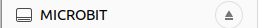|
| 2 | Als je de plek waar "MICROBIT" staat **NIET** kunt vinden, probeer dan de Micro:bit opnieuw aan te sluiten op je computer. |
| 3 | Ga naar het mapje genaamd "Micro:bit" dat je in stap 4 hebt gemaakt en zoek daar het bestand "microbit-Mijn-naam.hex" dat je in stap 4 hebt opgeslagen. |
| 4 | Kijk waar de USB-aansluiting "MICROBIT" staat. ``\\`` |
| 5 | Sleep het bestand "microbit-Mijn-naam.hex" naar de plek die "MICROBIT" heet. |
| 6 | Kijk of het lampje aan de achterkant van je Micro:bit begint te knipperen! Wacht totdat je jouw naam op het Led-display ziet verschijnen en het lampje stopt met knipperen. Dan weet je dat de code nu op je Micro:bit staat. |
||

## Stap 6 - Micro:bit gebruikershandleiding

De gebruikerhandleiding van de [micro:bit](https://microbit.org/nl/get-started/user-guide/overview/).

#### Opdracht

Wat is er allemaal nieuw in versie V2? Bij het Coderdojo lab van LeusdenZeT werk je met de orginele Micro:bit.

## Samenvatting

In deze les leer je programmeren voor de Micro:bit. Je hebt een BBC Micro:bit, een laptop met USB-aansluiting en een USB-kabel nodig. Je gaat naar de MakeCode-website voor de Micro:bit en maakt een programma waardoor je naam op het LED-display verschijnt. Je leert ook hoe je het programma kunt opslaan en op de Micro:bit kunt zetten. De Micro:bit is een klein apparaatje dat je kunt programmeren om verschillende dingen te doen. Je kunt bijvoorbeeld instellen dat de Micro:bit een boodschap laat zien wanneer hij wordt aangezet of een lichtje laat knipperen. Met deze blokken kun je de Micro:bit heel precies programmeren en allerlei leuke dingen maken.