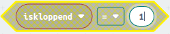

# 2 Variabelen, lussen en als...dan gebruiken

*In deze les leer je belangrijke dingen als je wilt programmeren.*

### Inhoud

```@contents
Pages = ["chapter2.md"]
```

## Inleiding

Ben jij geïnteresseerd in programmeren? Dat is geweldig! Programmeren is het proces waarbij we een computer of een apparaat zoals de Micro:bit vertellen wat het moet doen. En in deze introductie zal ik je vertellen over een paar belangrijke concepten in het programmeren, namelijk variabelen, lussen en als...dan verklaringen en hoe je ze kunt gebruiken met de Micro:bit, samen met specifieke besturingstoetsen zoals knop A en knop B.

Laten we beginnen met variabelen: een variabele is een gegeven dat we kunnen opslaan en gebruiken in ons programma. Het kan bijvoorbeeld een getal of een woord zijn. Met variabelen kunnen we informatie opslaan en later weer ophalen. Stel je voor dat je een programma maakt om de score bij te houden van een spel dat je speelt op de Micro:bit. Dan kun je een variabele genaamd 'score' maken en deze elke keer dat je een punt scoort met 1 verhogen.

Lussen zijn ook belangrijk bij het programmeren. Een lus is als een herhalingsproces waarbij een stukje code meerdere keren wordt uitgevoerd. Hiermee kunnen we bijvoorbeeld een bepaalde actie meerdere keren herhalen. Stel je voor dat je een programma schrijft om een ​​patroon van lichtjes te maken op de Micro:bit. Dan kun je een lus gebruiken om hetzelfde stukje code te herhalen totdat het patroon is voltooid.

Ten slotte zijn er de als...dan verklaringen. Deze helpen ons om beslissingen te nemen in ons programma. Als bijvoorbeeld de knop A op de Micro:bit wordt ingedrukt, willen we wellicht een bepaalde actie uitvoeren, zoals het verhogen van de score. Dit kan worden gedaan met een als...dan verklaring.

Dus daar heb je het, een korte introductie tot programmeren met de Micro:bit. Met variabelen, lussen en als...dan verklaringen kunnen we complexe programma's schrijven die ons helpen om de Micro:bit te besturen en leuke dingen te maken!

## Wat heb je nodig

- [BBC Micro:bit – Go:Bundle V2](https://elektronicavoorjou.nl/product/bbc-microbit-gobundle-v2/).
- Micro USB aan Standaard USB kabel (is onderdeel van de bovenvermelde kit).
- Laptop met een moderne browser (Chrome, Firefox, Safari) met een standaard USB aansluiting.

## Wat ga je doen

We gaan een kloppend hart maken dat niet vanzelf klopt. Maar als we op knop A drukken, gaat het hart kloppen. Als we op knop B drukken, stopt het hart met kloppen. Als we op beide knoppen drukken terwijl het hart al klopt, gaat het langzamer kloppen.

Dus we hebben knop A en knop B om het hart te laten knipperen of stoppen, en als we beide knoppen indrukken, gaat het langzamer kloppen.

Stap 1: Hoe een kloppend hart maken?

Stap 2: Algemene strategie.

Stap 3: Bedenk wat er moet gebeuren als de computer begint. 

Stap 4: Bedieningselementen instellen.

Stap 5: Bedenk wat de computer steeds moet blijven doen.

Stap 6: Testen in de simulator.

## Voorwaarden

Je hebt les 1 van deze Micro:bit cursus gevolgd.

## Stap 1 - Hoe een kloppend hart maken?

We maken een koppend hart door steeds afwisselend de Led-lampjes aan te zetten en dan weer uit te zetten:


Je ziet het hart in de simulator op het scherm kloppen. Je kunt het hart langzamer laten kloppen door de micro:bit steeds een halve seconde te laten wachten. In de basis categorie heb je een blok dat "pauzeer (ms)" heet. "ms" staat voor milliseconden, dus het aantal duizenden van een seconde. Dus een halve seconde is gelijk aan 500 ms.

Sleep het blok "pauzeer (ms)" tussen de twee "toon lichtjes" blokken en stel het in op 500ms door op het keuze pijltje te drukken.


Je ziet het hart langzamer kloppen.

## Stap 2 - Algemene strategie

Een algemene strategie is een soort plan of manier om iets te doen. Het is als een kaart die je gebruikt om de weg te vinden. Het helpt je om stap voor stap te weten wat je moet doen om je doel te bereiken. Het is net als een spel waarbij je een plan bedenkt om te winnen. Met een algemene strategie kun je succesvol zijn en problemen oplossen. Het uitgangspunt is:

- het hart klopt niet.
- als we op knop A drukken gaat het hart kloppen.
- als we op knop B drukken stopt het hart met kloppen.
- als we knop A en B drukken dan gaat het hart langzamer kloppen.

Hoe kun je dat doen? Je kunt het regelen door een speciale naam te geven aan iets dat kan veranderen. In de computer noemen we dat een "variable". Bijvoorbeeld, je kunt het "iskloppend" noemen als je wilt.

Als "iskloppend" gelijk is aan 0, dan betekent dat het hart niet klopt. Maar als het gelijk is aan 1, dan klopt het wel. Om dit te regelen, kun je een "als...dan" blok gebruiken dat je kunt vinden onder de categorie "Logisch". Je kunt dan de "toon lichtjes" blokken binnen dit blok plaatsen.


In het "als...dan" blok gebruik je iets dat "Vergelijking" heet in de plaats van "waar". Bijvoorbeeld, "iskloppend = 1". De vergelijkingen kun je ook vinden in het "Logisch" blok.

Hoe weet je of iemand op knop A drukt? Dat kun je te weten komen met behulp van de blokken uit de "Invoer" categorie, bijvoorbeeld "wanneer knop A wordt ingedrukt". Als je met je muis over het pijltje gaat, zie je welke keuzes je hebt, zoals A of B of A+B. A+B betekent dat je beide knoppen indrukt. Je kunt dit zien in het plaatje hieronder:


Om het tempo van je hart te veranderen, kun je ook een variabele gebruiken, die je bijvoorbeeld "snelheid" noemt. Als je "snelheid" op 0 zet, klopt je hart snel en als je "snelheid" op 500 zet, klopt het langzamer. Als je beide knoppen tegelijk indrukt, wissel je steeds van tempo. 

## Stap 3 - Bedenk wat er moet gebeuren als de computer begint

Wanneer je een computerprogramma maakt, wil je misschien beginnen met het instellen van een bepaalde waarde die je later in het programma kunt gebruiken. Dit doe je meestal in het begin van het programma, in een speciaal blok dat "bij opstarten" heet. Maar voordat je die waarde kunt instellen, moet je eerst zeggen wat voor soort waarde het is en hoe je het wilt noemen. Dit noemen we het maken van een 'variabele'. Om dit te doen, kun je het blok "Variabelen" gebruiken.

|Stap        | Actie      |
|:---------- | :---------- |
| 1 | Klik op de knop "Maak een variabele" in de categorie "Variabelen". ``\\`` |
| 2 | Typ "iskloppend". ``\\`` |
| 3 | Druk op de knop "OK". ``\\`` |
| 4 | Sleep "stel iskloppend in op 0" naar het blok "bij opstarten". ``\\`` |
| 5 | Klik op de knop "Maak een variabele" in de categorie "Variabelen". |
| 6 | Typ "snelheid". |
| 7 | Druk op de knop "OK". |
| 8 | Sleep "stel snelheid in op 0" naar het blok "bij opstarten". ``\\`` |

## Stap 4: Bedieningselementen instellen

In deze stap ga je aan de computer uitleggen wat hij moet doen in een nieuwe situatie. Het is een beetje zoals wanneer je aan een vriend uitlegt wat hij moet doen als er iets verandert. Maar in plaats daarvan praat je met de computer en vertel je hem welke informatie hij moet gebruiken om de juiste dingen te doen. Dit doe je door bepaalde waarden te veranderen, zodat de computer weet wat hij moet doen.

- Er wordt op knop A gedrukt.
- Er wordt op knop B gedrukt.
- Er wordt op knop A en B gedrukt.

#### Er wordt op knop A gedrukt

Het hart moet gaan kloppen, dat betekent dat we aan de computer moeten vertellen dat het tijd is om het hart te laten kloppen. Dit doen we door een speciale code te geven, genaamd "iskloppend". We moeten de waarde van "iskloppend" veranderen van 0 naar 1, zodat de computer weet dat het hart moet gaan kloppen. Het is als het geven van een seintje aan de computer om het hart aan te zetten.

|Stap        | Actie      |
|:---------- | :---------- |
| 1 | Sleep het blok "wanneer knop A wordt ingedrukt". Dit blok vind je in de categorie "Invoer".  ``\\`` |
| 2 | Klik met je rechtermuistoets op het blok "stel iskloppend in op 0" in het blok "bij opstarten". ``\\`` |
| 3 | Klik op "Dupliceren". Je krijgt een kopie ervan op je werkblad. ``\\`` |
| 4 | Sleep de kopie in het blok "wanneer knop A wordt ingedrukt" en verander de waarde van de variabele in "1". ``\\`` |
||

##### Opdracht 1

1. Maak een kopie van het blok "wanneer knop A wordt ingedrukt".
2. Klik op het keuzepijltje en verander de A in B.
4. Verander de waarde van "iskloppend" in 0.

``\\``*Het resultaat na opdracht 1*

## Stap 5 - Bedenk wat de computer steeds moet blijven doen

We zijn bijna klaar. We moeten nog een "als...dan" blok maken voor de lichtjes met een vergelijking dat het hart moet gaan kloppen als op toets A wordt gedrukt.

|Stap        | Actie      |
|:---------- | :---------- |
| 1 | Sleep de lampjes uit het "de hele tijd" blok. Pak het vast bij het bovenste "toon lichtjes" blok. ``\\``
| 2 | Sleep een "als...dan" blok uit de categorie "Logisch" in het "de hele tijd" blok. ``\\`` |
| 3 | Sleep het blok "0 = 0" uit "Logisch" naar je werblad. ``\\`` |
| 4 | Klik op de categorie "Variabelen" en sleep de variabele "iskloppend" naar een vergelijking. Verbind de twee rode stippen met elkaar. ``\\`` |
| 5 | Stel de waarde in op "1". ``\\`` |
| 6 | Sleep de vergelijking naar het "als...dan" blok. Je hebt de vergelijking voor het als...dan blok ingesteld: 'als iskloppend gelijk is aan 1'. ``\\`` |
| 7 | Sleep de lampjes binnen het "als...dan" blok. |
| 8 | Sleep de variabele "snelheid" naar het "pauzeer (ms)" blok. Maak een kopie van het blok en zet dat onder het laatste "toon lichtjes" blok. ``\\`` |
||


##### Opdracht 2

Probeer de volgende opdracht uit te voeren.

1. Maak een kopie van het blok "wanneer knop A wordt ingedrukt".
2. Klik op het keuzepijltje en verander de "A" in "A + B".
3. Gebruik een "als...dan...anders" blok.
   - Als de snelheid 0 is verander de snelheid in 500.
   - Als de snelheid 500 is verander de snelheid in 0.

``\\``*Het resultaat na opdracht 2*

Niet raar als je dit een lastige opdracht vond. Maar je bent inmiddels wel een echte progtrammeur geworden. Of alles werkt zoals het moet merk je als je stap 6 hebt gedaan.

## Stap 6 - Testen in de simulator

Test de volgende functies:
- Er wordt op knop A gedrukt: het hart gaat kloppen.
- Er wordt op knop A + B gedrukt: het hart gaat langzamer kloppen.
- Er wordt weer op knop A + B gedrukt: het hart gaat sneller kloppen.
- Er wordt op knop B gedrukt: het hart stopt met kloppen.
- Er wordt op knop A gedrukt: het hart gaat kloppen.


Zoals je op het plaatje ziet is de A + B toets een aparte toets op de simulator.


##### Opdracht 3

1. Bewaar je code in de Micro:bit folder.
2. Sleep de code naar je Micro:bit.
3. Test dezelfde functies als in de simulator.

Als je niet meer weet hoe je dat moet doen kijk dan naar:
- [Les 1 - Stap-4-Code-op-je-laptop-bewaren](../chapter1/index.html#Stap-4-Code-op-je-laptop-bewaren)
- [Les 1 - Stap-5-Code-naar-de-Micro:bit-overzetten](../chapter1/index.html#Stap-5-Code-naar-de-Micro:bit-overzetten)

## Samenvatting
In deze les leer je de basisconcepten van programmeren, namelijk variabelen, lussen en als...dan verklaringen, en hoe je ze kunt gebruiken met de Micro:bit. Variabelen zijn stukjes informatie die we kunnen opslaan en later weer kunnen ophalen. Lussen zijn herhalingsprocessen die een stukje code meerdere keren uitvoeren. Als...dan verklaringen helpen ons beslissingen te nemen in ons programma. Je hebt een Micro:bit, een USB-kabel en een laptop nodig de les te volgen.

Op de homepagina van [MakeCode](https://makecode.microbit.org/) staan allerlei cursussen die je kunt volgen!

Je kunt ook het 'kloppend-hart' importeren vanuit je MakeCode homepagina met https://github.com/rbontekoe/kloppend-hart:
- open https://makecode.microbit.org/
- klik op Importeren en klik vervolgens op Importeer URL
- plak https://github.com/rbontekoe/kloppend-hart en klik op importeren

 ``\\``*De toets 'Importeren' staat op de [MakeCode homepagina](https://makecode.microbit.org/) onder de banner rechts*