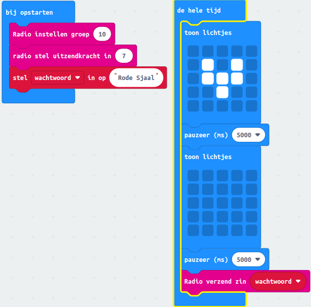
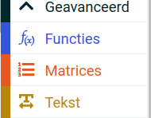
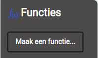
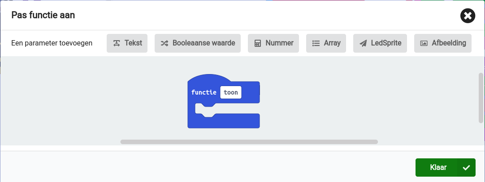
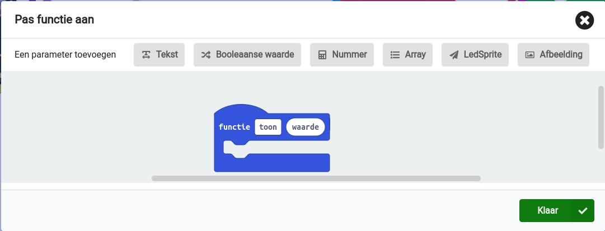
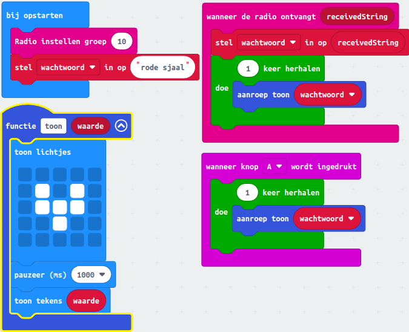

# 3 Radio communicatie tussen Micro:bits

*De Micro:bit kan goed informatie uitwisselen met andere Micro:bits. We gaan een spel maken dat vossenjacht heet. Eén persoon is de vos en alle andere kinderen gaan de vos zoeken. De vos heeft een rode sjaal en een Micro:bit om zijn nek. Op het scherm van de Micro:bit van de vos zie je om de 5 seconden een plaatje van een vos. De vos heeft zich verstopt en alle andere kinderen hebben ook een Micro:bit. Als ze dicht genoeg bij de vos komen, dan geeft de Micro:bit van de vos een teken dat je in de buurt bent.*

### Inhoud

```@contents
Pages = ["chapter3.md"]
```

## Inleiding

Hey, ik ga je vertellen over een tof spel dat je kunt maken met je micro:bit. Het heet "Vossenjacht"! Eén van jullie zal de "vos" zijn en hij draagt een micro:bit om zijn nek. Je kunt de "vos" herkennen aan een bericht dat zijn of haar micro:bit uitzendt. (Een vrouwtjesvos noem je een moer, het mannetje is een rekel.)

Het bericht wordt verstuurt via "radio communicatie" en je hebt er geen wifi voor nodig om het te gebruiken. De blokken om het te gebruiken staan in de categorie "Radio".

De rest van jullie zijn de "jagers" en jullie hebben ook een micro:bit die op hetzelfde kanaal als de "vos" staat ingesteld. De micro:bit van de "vos" stuurt een bericht over iets wat de "vos" kenmerkt en jullie moeten hem vinden!

In een open ruimte kun je de "vos" tot wel 70 meter ver weg vinden, maar als er muren of andere obstakels zijn, zal de afstand korter zijn. Als je dichtbij genoeg bent, krijg je een bericht op je micro:bit en moet je de "vos" vinden!

Het allerleukste is natuurlijk als je dit spel met al je vriendjes speelt. Nodig ze dus uit om mee te doen! Je kunt de blokken in de categorie "Radio" gebruiken om het spel te programmeren en te spelen.

## Wat je nodig hebt

- [BBC Micro:bit – Go:Bundle V2](https://elektronicavoorjou.nl/product/bbc-microbit-gobundle-v2/).
- Mico USB aan Standaard USB kabel (is onderdeel van de bovenvermelde kit).
- Laptop met een moderne browser (Chrome, Firefox, Safari) met een standaard USB aansluiting.

De [Coderdojo club van LeusdeZet in Leusden](https://www.leusdenzet.nl/events-category/coderdojo/) heeft voldoende micro:bits om het spel mee te spelen.

## Wat je gaat doen

Stap 1: de vos maken.

Stap 2: een jager maken.

Stap 3: het vossenspel testen.

## Stap 1 - De vos maken

Je bent inmiddels zo gevorderd dat je dit diagram makkelijk kunt begrijpen. De vos zendt een wachtwoord uit waaraan hij of zij te herkennen is en dat de jager tegen de vos moet zeggen.



##### Bespreking van de code

Tijdens het starten van de micro:bit wordt voor het uitzendkanaal 10 gekozen. De sterkte van het signaal staat op 7 en dat betekent dat het bericht op maximale sterkte wordt uitgezonden.

Tevens wordt het wachtwoord gezet op "rode sjaal". Hieraan is de vos te herkennen. Maar het wachtwoord moet je moet je wel veranderen!

In het "de hele tijd" blok wordt het symbool van de vos gedurende 5 secnden op het led-display getoond, zodat de jager weet dat het de vos. Tevens wordt het wachtwoord uitgezonden, dat uiteindelijk op het led-display te lezen is.

##### Multiple choice vragen

Het doel van deze test is om te controleren of je het spel en de code goed begrijpt. De antwoorden staan in de bijlage.

**Op welk kanaal wordt het bericht uitgezonden tijdens het starten van de micro:bit?**
1. Kanaal 5
2. Kanaal 7
3. Kanaal 10

**Wat betekent een sterkte van 7 voor het uitgezonden signaal?**
1. Het signaal wordt niet uitgezonden
2. Het signaal wordt zwak uitgezonden
3. Het signaal wordt op maximale sterkte uitgezonden

**Waarom moet het wachtwoord veranderd worden?**
1. Om de jagers in de war te brengen
2. Om te voorkomen dat de vos gevangen wordt
3. Om de veiligheid van het spel te waarborgen

**Hoe lang wordt het symbool van de vos op het led-display getoond?**
1. 2 seconden
2. 5 seconden
3. 10 seconden

##  Stap 2 - een jager maken

In het spel moet de jager het wachtwoord van een vos weten om de vos te kunnen vangen. De jager ziet het wachtwoord op zijn scherm en zegt het dan tegen de vos.

Maar nu gaan we iets nieuws leren: een **functie**! Een functie is een soort gereedschap in het programmeren waarmee je taken gemakkelijk kunt hergebruiken in een programma. Je kunt een grote taak opdelen in kleine stukjes code die elk een kleine taak doen. Wanneer je de functie gebruikt, doet het wat je vraagt en geeft het resultaat terug.

We gaan een functie maken als je het wachtwoord van de vos via de radio ontvangt. We gaan een functie maken om te testen of het ook werkt als we op knop A drukken. We gebruiken hiervoor het hulpwachtwoord "rode sjaal". Maar ook om te testen of je code werkt.

Een functie heeft een naam en argumenten: geen, één of meerdere. In ons geval is het argument het wachtwoord dat we van de vos ontvangen of als je de test doet.

Om een functie te maken, moeten we deze stappen volgen:

|Stap        | Actie      |
|:---------- | :---------- |
| 1 | Klik op "Geavanceerd" en dan op "Functies". ``\\`` |
| 2 | Klik op "Maak een functie...". ``\\`` |
| 3 | Typ "toon" in het witte vak naast "Functie". ``\\`` |
| 4 | Definieer het argument: klik op "tekst" en geef het de naam "waarde". ``\\`` |
| 5 | Druk op de knop "Klaar". |
|| 

Als we nu de code schrijven, moeten we het blok "aanroep toon" gebruiken uit de categorie "Functies". Zo wordt onze functie gebruikt in het programma.



##### Bespreking van de code

Tijdens het starten van de micro:bit wordt het kanaal op hetzelfde kanaal gezet als dat van de vos, namelijk kanaal 10. Ten behoeve van de test maken we ook een wachtwoord aan met de waarde "rode sjaal". Deze waarde wijkt dus af van het echte wachtwoord van de vos.

Als op knop A wordt gedrukt moet het symbool van de vos verschijnen op het led-display gedurende 1 seconde. Daarna wordt het wachtwoord "rode sjaal" getoond. Hiermee testen we de applicatie.

De functie "toon" wordt zowel in beide events gebrukt "wanneer de radio ontvangt" en "wanneer knop A wordt ingedrukt.

Let wel op dat het wachtwoord van de vos ook wordt opgeslagen in de variabele "wachtwoord"! Dus zorg ervoor dat de vos uitstaat als je gaat testen.

##### Multiple choice vragen

Het doel van deze test is om te controleren of je het spel en de code goed begrijpt. De antwoorden staan in de bijlage.

**Wat is een functie in programmeren?**
1. Een gereedschap om de code te onderhouden
2. Een kleine taak in een programma
3. Een manier om taken te hergebruiken in een programma

**Waarom zijn functies handig in programmeren?**
1. Omdat ze grote klussen opdelen in kleine stukjes code
2. Omdat ze code gemakkelijker maken om te begrijpen en onderhouden
3. Beide antwoorden zijn correct

**Wat zijn argumenten in een functie?**
1. Namen die worden gegeven aan variabelen in een programma
2. Kleine taken die de functie uitvoert
3. Gegevens die de functie nodig heeft om zijn taak uit te voeren

**Waarom wordt er een testwachtwoord gebruikt in de tekst?**
1. Om het wachtwoord van de vos te vervangen
2. Om te testen of de code werkt
3. Om de radio-ontvangst te verbeteren

**Wat gebeurt er als op knop A wordt gedrukt?**
1. Het symbool van de vos verschijnt op het led-display
2. Het wachtwoord van de vos wordt getoond op het scherm
3. De micro:bit wordt uitgeschakeld

**Welke functie wordt gebruikt in zowel "wanneer de radio ontvangt" als "wanneer knop A wordt ingedrukt"?**
1. De functie "start"
2. De functie "stop"
3. De functie "toon"

## Stap 3 - het vossenspel testen

Test het vossenspel.

1. Zet de micro:bit van de jager aan en druk op knop A.

2. Zet micro:bit van de vos aan en kijk of je het wachtwoord ontvangt.

## Samenvatting

In dit project wordt uitgelegd hoe je een spel genaamd "Vossenjacht" kunt maken met de Micro:bit, een kleine computer. Het spel bestaat uit één "vos" en verschillende "jagers" die de vos moeten vinden. De vos draagt een Micro:bit met een rode sjaal en zendt om de vijf seconden een kenmerkend signaal uit dat door de jagers wordt ontvangen. Het spel gebruikt radio-communicatie tussen de Micro:bits en je kunt de radiofuncties programmeren met behulp van de blokken in de categorie "Radio" op de Micro:bit. Dit spel kan met vrienden gespeeld worden en er worden instructies gegeven voor het maken van de "vos" en de "jagers" en het testen van het spel. Ook heb je geleerd hoe je zelf een functie maakt.
