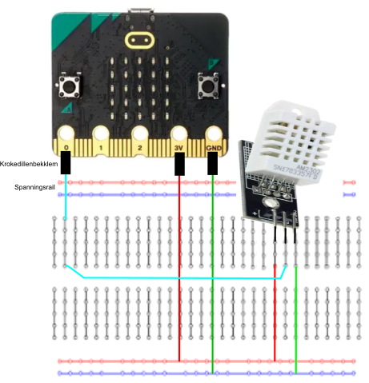
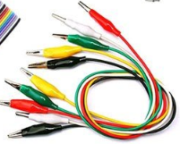

# 4. Soorten sensoren

*Bij het werken met de micro:bit heb je te maken met twee dingen: sensoren (om informatie te krijgen) en actuatoren (om iets te laten bewegen). Sensoren gebruik je om dingen te meten, bijvoorbeeld hoe warm het is, hoe vochtig de lucht is, of hoe vochtig de grond is. Met actuatoren kun je dingen laten bewegen, bijvoorbeeld een motor om een wijzer te laten draaien of een kraan om planten water te geven. Je hebt ook te maken met apparaten waarop je dingen kunt laten zien, dat noemen we displays. Bij de micro:bit zijn dat de kleine lichtjes op het bord, maar het kan ook een ander scherm zijn dat je bedient via de I2C bus, zoals een OLED display.*

## Leerdoelen

- Het doel is om de temperatuur en luchtvochtigheid te meten in je kamer met een DHT22.
- Het einddoel is om een weerstation op te zetten met radio, in de blog behandelen?

### Inhoud

```@contents
Pages = ["chapter4.md"]
```
## Inleiding

De micro:bit heeft een aantal [ingebouwde sensoren](https://microbit.org/nl/get-started/first-steps/sensors/) waaronder een omgevingslichtsensor, een temperatuursensor, een versnellingsmeter en een kompas.

Daarnaast zijn er ook externe sensoren, zoals de DHT22. Het is een sensor die de temperatuur en luchtvohtigheid meet. Daar gaat deze les over.

## Wat je nodig hebt

Dit is een inleidende les voor de komende twee lessen. Je hebt geen dingen nodig.

## Wat je gaat doen

Het verhaal over de DHT11/DHT22 en het breadboard lezen.

## DHT11/DHT22

Als je de temperatuur en luchtvochtigheid in je kamer wilt meten, kun je sensoren gebruiken zoals de DHT11 of DHT22.

De DHT11 of DHT22 meet de temperatuur en geeft dit weer als een spanning tussen 0 en 3,3 Volt. Hoe hoger de spanning, hoe hoger de temperatuur. De DHT11 meet tussen de 0 en 50 graden Celsius en de DHT22 tussen -40 en +80 graden Celsius.

Er zijn verschillende soorten sensoren, sommige hebben drie pinnen en anderen vier. Bij de drie-pins versies van de DHT11/DHT22 sensoren hoef je geen extra onderdelen te gebruiken, maar bij de vier-pins versies wel.

Om de sensor te gebruiken, moet je eerst een speciaal programma downloaden. Dit is een soort handleiding die de micro:bit (een kleine computer) helpt de sensor te begrijpen en te gebruiken.

Als je het elektronisch circuit (de sensoren en de micro:bit) gaat bouwen, gebruik je een breadboard en jumperkabels. Dit zijn soort draden waarmee je de verschillende onderdelen van het circuit aan elkaar koppelt.

## Hoe werkt een breadboard?



Een [breadboard](https://nl.wikipedia.org/wiki/Breadboard)) werkt als een soort basis waarop je elektronische onderdelen kunt aansluiten en verbinden zonder dat je hoeft te solderen.

De gaatjes in een kolom op een breadboard zijn met elkaar verbonden, behalve bij de spanningsrails aan de onder- en bovenkant van het breadboard.

De elektronische onderdelen prik je in de gaten van het breadboard en koppel je met jumperkables. Er zijn drie soorten jumperkabels: een met aan beide kanten een vrouwtje, een met aan de ene kant een mannetje en aan de andere kant een vrouwtje, en een met aan beide kanten een mannetje. Een mannetje heeft een pinnetje, een vrouwtje heeft een gaatje. Zo kun je altijd de onderdelen met elkaar verbinden.

Als je elektronische onderdelen wilt verbinden met de micro:bit, kun je hiervoor krokedillenklemmen gebruiken. ``\\`` ``\\``Onderdeel van de [Basis Kit voor BBC Micro:bit](https://elektronicavoorjou.nl/product/basis-kit-voor-bbc-microbit/), zie ook de [user guide](https://www.elecrow.com/download/Tutorial_for_microbit_basic_kit.pdf)

Dit zijn kleine klemmetjes die je op de micro:bit kunt klemmen, zodat je verbinding kunt maken met de elektronische onderdelen. Het kan echter ook zijn dat je een breadboard hebt met een connector waarin de micro:bit past. In dat geval kun je de micro:bit op in de connector stoppen en de verbindingen maken met jumperkabels.

De spanningsrails zijn bedoeld om de stroomtoevoer naar de onderdelen te regelen. De rail met de rode streep is de positieve (+) voedingsrail en de rail met de blauwe streep is de negatieve (-) voedingsrail. Deze voedingsrails zijn horizontaal verbonden, zodat alle gaatjes in dezelfde rij zijn verbonden met dezelfde spanningsrail. Dit betekent dat als je een onderdeel aansluit op een gaatje in de positieve voedingsrail, alle andere gaatjes in dezelfde rij ook verbonden zijn met de positieve voedingsrail.

## Leveranciers van benodigheden voor de micro:bit

Er zijn diverse leveranciers van kits, sensoren en actuatoren voor de BBC micro:bit, onder anderen:
- [Elektonica voor jou](https://elektronicavoorjou.nl/#%7B%22731234b1f9f9%22%3A%7B%22search_term%22%3A%22micro%3Abit%22%2C%22filters%22%3A%5B%5D%2C%22sorting%22%3A%5B%5D%2C%22offsets%22%3A%7B%22category%22%3A12%2C%22product%22%3A84%7D%2C%22y_pos%22%3A0%7D%7D)
- [Kiwi Electronics](https://www.kiwi-electronics.com/nl/bbc-microbit-boards-bundels-accessoires-276?page=3)
- [SOS solutions](https://www.sossolutions.nl/educatief/micro-bit?p=2)

## Stuursoftware

Als je wil weten of er speciale computersoftware is voor een onderdeel, dan kan je op deze website kijken:
- Uitbreidingen pagina voor [MakeCode](https://makecode.microbit.org/extensions)

Als je klikt op "Individual Sensoren", dan zie je dit plaatje ertussen staan: ``\\``

Als je op een afbeelding klikt, krijg je extra uitleg. In de volgende les leer je hoe je de software kunt downloaden en gebruiken.


## Samenvatting

Als je werkt met de micro:bit, heb je sensoren nodig om informatie te krijgen en actuatoren om dingen te laten bewegen. Sensoren meten dingen zoals de temperatuur en luchtvochtigheid. De DHT22 is een sensor die de temperatuur en luchtvochtigheid meet. Om deze te gebruiken, heb je een speciaal programma nodig en moet je de sensor aansluiten op een breadboard met jumperkabels. 

Een breadboard is een basis waarop je elektronische onderdelen kunt aansluiten en verbinden zonder te hoeven solderen. De gaatjes in de kolommen op het breadboard zijn met elkaar verbonden, behalve bij de spanningsrails aan de bovenkant en onderkant van het breadboard. De spanningsrails zijn bedoeld om de stroomtoevoer naar de onderdelen te regelen. De rail met de rode streep is de positieve (+) voedingsrail en de rail met de blauwe streep is de negatieve (-) voedingsrail.