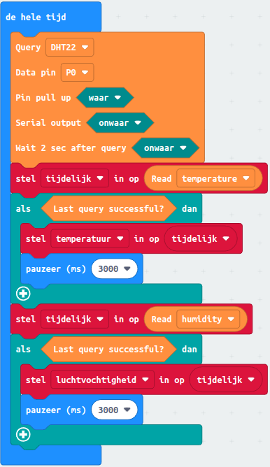

# 5. Temperatuur meten

*We gaan vandaag leren over een slim onderdeel dat de temperatuur en vochtigheid in een kamer kan meten. Het heet de DHT22 sensor en is heel handig! We gaan ook leren hoe we de computerprogramma's kunnen schrijven om de temperatuur te meten.*

### Inhoud

```@contents
Pages = ["chapter5.md"]
```

## Wat je nodig hebt

- [BBC Micro:bit – Go:Bundle V2](https://elektronicavoorjou.nl/product/bbc-microbit-gobundle-v2/).

- Micro USB aan Standaard USB kabel (is onderdeel van de bovenvermelde kit).
- Een [breadboard met jumpers](https://elektronicavoorjou.nl/product/basis-kit-voor-bbc-microbit/).
- Een [DHT22](https://elektronicavoorjou.nl/product/dht22-temp-vocht-sensor/).
- Laptop met een moderne browser (Chrome, Firefox, Safari) met een standaard USB aansluiting.

## Voorwaarden

- Ervaring met de [online makecode](https://makecode.microbit.org/) voor de micro:bit.

## Wat je gaat doen

Stap 1: De micro:bit verbinden met de DHT22.

Stap 2: DHT22 stuursoftware downloaden.

Stap 3: Blokdiagram opzetten.

Stap 4: Testen van de software.

Stap 5: Testen of de meting gelukt is.

## Stap 1 - De micro:bit verbinden met de DHT22

Maak een opstelling zoals hier onder.


## Stap 2 - DHT22 stuursoftware downloaden

|Stap        | Actie      |
|:---------- | :---------- |
| 1 | Maak een nieuw project: "Temperatuur meten".
| 2 | Klik op de categorie "uitbreidingen". ``\\`` |
| 3 | Zoek naar "dht22". ``\\`` |
| 4 | Klik op het plaatje. ``\\`` |
| 5 | De uitbreiding wordt geinstalleerd. ``\\`` |

## Stap 3 - Blokdiagram opzetten

##### Algemene strategie

- Standaard instellingen zetten.
- Na meting temperatuur en luchtvochtigheid in een variabele opslaan.
- Wacht 5 seconden alvorens opnieuw een meeting uit te voeren. 
- Als op toets A wordt gedrukt wordt de temperatuur getoond.
- Als op toets B wordt gedrukt wordt de luchtvochtigheid getoond.

##### Bedenk wat er moet gebeuren als de computer begint

Maak de volgende twee variabelen en zet beiden in het blok "bij opstarten".
- temperatuur
- luchtvochtigheid 

 ``\\``*Resultaat na "Bedenk wat er moet gebeuren als de computer begint"*

##### Bedieningselementen instellen

- Toets A laat de temperatuur zien.
- Totes B laat de luchtvochtigheid zien.

 ``\\``*Resultaat na "Bedieningselementen instellen"*

##### Bedenk wat de computer steeds moet blijven doen

- Instellingenblok goed zetten.
- Temperatuur meten en opslaan in de variabele temperatuur. De temperatuur meet je met het "Read humidity" blok. Kies voor "temperature" in plaats van "humidity". Plaats het in het "stel temperatuur in" blok.
- Luchvochtigheid meten en opslaan in variabele luchtvochtigheid. De temperatuur meet je met het "Read humidity" blok.
- Wacht 2 seconden.

Ik heb gemerkt dat je het instellingenblok het beste in het "de hele tijd" blok kunt zetten. Het instellingblok stel je zo in:
- Query: DHT22
- Data pin: P0
- Pin pull-up: waar
- Serial output: onwaar
- Wait 2 sec after query: waar

 ``\\``*Bedenk wat de computer steeds moet blijven doen*

##### Diverse opmerkingen

Onder de optie **…meer** in de categorie DHT11/DHT22 heb je het opdrachtblok  Temperature type: Celsius (*C) waarmee je de temperatuurweergave instelt op graden Celsius of Fahrenheit. Het is de standaard instelling, dat betekent dat als je deze opdracht weglaat de gemeten waarde altijd in graden Celsius is.

Het instellingenblok gebruik je om een aantal zaken in te stellen:
- *Query:* de sensor die je gebruikt, de DHT11 of de DHT22. De DHT11 heeft een bereik van 0 tot 50 graden Celsius, terwijl de DHT22 een bereik heeft van -40 to +80 °C. Bij ons staat het op de DHT22,
- *Data pin:* op welk pin van de micro:bit de datadraad is aangesloten. Bij ons staat hij ingesteld op P0.
- *Pin pull-up:* de 3-pinsuitvoering van de DHT11/DHT22 sensoren hebben een interne pull-downweerstand en kies je voor waar. Bij de v4-pinsuitvoeringen moet je een externe weerstand gebruiken van ongeveer 10KΩ en kies je voor onwaar. De weerstand zorgt ervoor dat de spanning op de datadraad in rust 0 Volt is dat overeenkomt met -40 °C voor de DHT22.
- *Serial output:* of je gebruik wilt maken van seriële overdracht van de gegevens, bijvoorbeeld naar een ESP8266 module.
- *Wait 2 sec after query:* voor de DHT22 stel je de wachttijd voor de meting in op minimaal 3 seconden.


## Stap 4 - Testen van de software

Als je op de A-knop drukt, laat de micro:bit zien hoe warm het is. Het toont ook een getal met een punt erin, dat betekent dat het heel precies is. Als je op de B-knop drukt, laat de micro:bit zien hoe vochtig de lucht is. Ook hier wordt er een getal met een punt getoond. Een punt in het Engels is hetzelfde als een komma in het Nederlands.

## Stap 5 - Testen of de meting gelukt is

Soms werkt het meten van de temperatuur en luchtvochtigheid niet goed. Daardoor kan er een foute waarde worden opgeslagen. Gelukkig is er een manier om te testen of het meten gelukt is. We kunnen de juiste waarde tijdelijk opslaan in een variable "tijdelijk" en dan controleren of het meten gelukt is. Als dat zo is, kunnen we de juiste waarde in een speciale plek bewaren. Zo weten we zeker dat we de goede temperatuur en luchtvochtigheid hebben gemeten en opgeslagen.



Test de software opnieuw!

Soms gebeurt het dat de code op de computerchip vastloopt. Maar maak je geen zorgen. Je kunt het oplossen door op de knop "reset" te drukken of door het opdrachtblok "reset" te gebruiken. Dit zorgt ervoor dat de micro:bit weer goed gaat werken.

## Test je kennis

Wat meet de DHT22 sensor?
1. Temperatuur en vochtigheid
2. Luchtdruk en windsnelheid
3. Lichtintensiteit en geluidsniveau

Welke computerprogramma's leer je schrijven tijdens deze les?
1. Tekstverwerkingsprogramma's
2. Spelletjes
3. Programma's om de temperatuur te meten

Wat heb je nodig om de DHT22 sensor met de micro:bit te verbinden?
1. Een breadboard met jumpers
2. Een telefoon met een moderne browser
3. Een toetsenbord en muis

Welke actie moet je ondernemen in stap 2 van de les om de DHT22 stuursoftware te downloaden?
1. Zoek naar "dht22" in de online makecode voor de micro:bit.
2. Download de software van de website van de fabrikant.
3. Vraag de leraar om de software op de computer te installeren.

Wat gebeurt er als je op toets A drukt tijdens het uitvoeren van het programma?
1. De luchtvochtigheid wordt getoond.
2. De temperatuur wordt getoond.
3. Het programma stopt met werken.

Wat moet je doen om de luchtvochtigheid te meten en op te slaan in een variabele?
1. Gebruik het "Read temperature" blok en sla het op in de variabele "luchtvochtigheid".
2. Gebruik het "Read humidity" blok en sla het op in de variabele "luchtvochtigheid".
3. Gebruik het "Wait" blok en sla het op in de variabele "luchtvochtigheid".

## Samenvatting

We leren hoe we met de DHT22 sensor de temperatuur en vochtigheid in een kamer kunnen meten. We sluiten het aan op een BBC Micro:bit en met zelfgeschreven computerprogramma's lezen we de metingen uit. Om dit project uit te voeren, moeten we de DHT22 software downloaden en het blokdiagram opzetten. Daarna kunnen we de software testen en de temperatuur en vochtigheid meten.

Zie ook: [https://github.com/rbontekoe/temperatuur-meten](https://github.com/rbontekoe/temperatuur-meten).