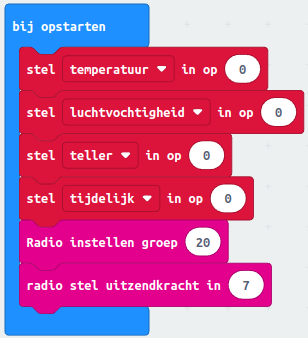
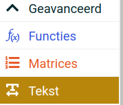
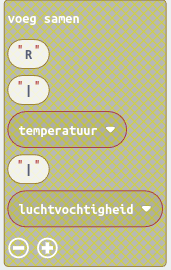
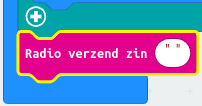
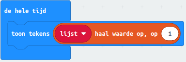

# 6. Gegevens uitwisselen tussen micro:bits

*Een DHT22 meet de temperatuur en de luchtvochtigheid. Hoe stuur je deze twee gegevens in een keer naar een ander micro:bit? Dat leer je in deze les.*

### Inhoud

```@contents
Pages = ["chapter6.md"]
```

## Wat je nodig hebt

Goed gedaan, je hebt les 5 "Temperatuur meten" afgerond! Maar je kunt ook de computercode downloaden via "importeren" op de website van [MakeCode](https://makecode.microbit.org/) . Klik op "Importeer URL" en kopieer de link "https://github.com/rbontekoe/temperatuur-meten" in het vakje dat verschijnt. Dan kun je de code gebruiken en ermee spelen!

Voor de volgende stappen heb je ook deze spullen nodig:
- [BBC Micro:bit – Go:Bundle V2](https://elektronicavoorjou.nl/product/bbc-microbit-gobundle-v2/).
- Micro USB aan Standaard USB kabel (is onderdeel van de bovenvermelde kit).
- Een [breadboard met jumpers](https://elektronicavoorjou.nl/product/basis-kit-voor-bbc-microbit/).
- Een [DHT22](https://elektronicavoorjou.nl/product/dht22-temp-vocht-sensor/).
- Een extra micro:bit bordje voor de ontvangst van de temperatuur en luchtvochtigheid.
- Laptop met een moderne browser (Chrome, Firefox, Safari) met een standaard USB aansluiting.

## Wat je gaat doen

Stap 1: Versturen van de temperatuur en luchtvochtigheid.

Stap 2: Extra micro:bit geschiktmaken voor de ontvangst.

## Stap 1 - Versturen van de temperatuur en luchtvochtigheid

De micro:bit die je in les 5 hebt gemaakt, ga je klaarmaken om informatie over de temperatuur en luchtvochtigheid samen te versturen. We gaan het versturen op kanaal 20. We beginnen met de hoogste sterkte te gebruiken, maar je kunt experimenteren en de sterkte verminderen als dat beter werkt in jouw situatie.

Herriner je nog hoe je het in les 3 hebt gedaan?

##### Algemene strategie

Je hebt misschien in les 1 gemerkt dat als je jouw naam in het "toon tekens" blok zet, het tussen aanhalingstekens wordt gezet. Bijvoorbeeld, "Rob". Dit noemen we een "string" in de computertaal. Dus "Rob" is een "string" en je kunt er niet mee rekenen!

We willen informatie over de temperatuur en luchtvochtigheid samen verzenden. We willen ook weten in welke kamer we het hebben gemeten. In les 5 hebben we geleerd om de temperatuur en luchtvochtigheid apart op te slaan als getallen. Maar als we de informatie samen willen verzenden, moeten we er een **zin** van maken, zoals: "rb | 24 | 60.5".

We gebruiken dus aanhalingstekens om onderscheid te maken tussen getallen en tekst.

Als de extra micro:bit een zin ontvangt, moeten we die zin in stukjes verdelen. Daarom zouden we het symbool "|" als scheidingsteken kunnen gebruiken.

##### Bedenk wat er moet gebeuren als de computer begint

We willen informatie naar een andere micro:bit sturen. Daarom moeten we ervoor zorgen dat beiden op hetzelfde kanaal staan ingesteld. We hebben gekozen voor kanaal 20 met een uitzendkracht van 7. Zorg ervoor dat je deze instellingen toevoegt aan de "de hele tijd" blok.



##### Bedieningselementen instellen

Deze informatie is op dit moment niet nodig.

##### Bedenk wat de computer steeds moet blijven doen

Elke keer dat we een zinvolle meting hebben gedaan willen we dat de informatie wordt verstuurd. 

Omdat we alleen gegevens wegschrijven tijdens het als..dan blokken als "Last query sucessful?" waar is hebben we altijd zinvolle gegevens. Het samenvoegen van de gegevens is het eenvoudigste met het opdrachtblok "voeg samen..." uit de categorie "Tekst" dat je te zien krijgt als je de categorie "Geavanceerd" opent.

We zorgen ervoor dat we alleen informatie versturen door "als...dan" blokken te gebruiken die zeggen dat de meting goed is gegaan. We gebruiken dan een blok genaamd "Voeg samen" om alle belangrijke informatie samen te voegen, zodat we het makkelijker kunnen versturen. Dit blok is te vinden in de categorie "Tekst" als je de categorie "Geavanceerd" opent.

Het algoritme is dus:
1. voeg de gegevens kamer, temperatuur en luchtvochtigheid samen, gescheiden door het "|" teken.
2. verstuur de zin.

Het hele proces, van het verzamelen van de gegevens tot het samenvoegen en versturen, wordt in de computerwereld een "algoritme" genoemd. Een algoritme is als het ware een stappenplan waarmee we de computer vertellen wat hij moet doen om de gewenste uitkomst te bereiken. In dit geval is het doel om belangrijke gegevens te verzamelen en deze te versturen naar een andere micro:bit.

Zorg ervoor dat je deze instellingen toevoegt aan de "bij opstarten" blok.

|Stap        | Actie      |
|:---------- | :---------- |
| 1 | Klik op de categorie "Geavanceerd" en vervolgens op de categorie "Tekst". ``\\`` |
| 2 | Sleep het blok "voeg samen..." naar je werkblad. ``\\`` |
| 3 | Verander "Hallo" door de eerste letter van je voornaam, bijvoorbeeld "R". |
| 4 | Veranderd "wereld" door het "\|" teken. ``\\`` |
| 5 | Klik op het "+" teken in het blok om aan te geven dat je meer wilt toevoegen. Er verschijnt een nieuw leeg veld. |
| 6 | Sleep de variabele "temperatuur" naar het lege veld. ``\\`` |
| 7 | Voeg vervolgens toe: \|, de variable "luchtvochtigheid"  ``\\`` |
| 8 | Voeg toe in het "de hele tijd" blok aan het einde, het blok "Radio verzend zin" ``\\`` |
| 9 | Sleep het blok "voeg samen..." er in. |
||

 ``\\``*Eind resultaat van "Bedenk wat de computer steeds moet blijven doen"*


## Stap 2 - Extra micro:bit geschiktmaken voor de ontvangst

Met de andere micro:bit laat je de ontvangen gegevens zien op het display.

##### Wat is een array?

Een array is als een doos met meerdere vakjes waarin je verschillende waarden kunt bewaren. Elk vakje heeft een specifiek nummer, wat het "indexnummer" wordt genoemd. Dit nummer begint meestal bij 0 en loopt op tot het aantal elementen in de array minus 1.

Stel je bijvoorbeeld een doos voor met zeven vakjes, genummerd van 0 tot 6, waarin je zeven verschillende kleuren kunt bewaren. Je zou de doos kunnen vullen met de volgende kleuren: rood, oranje, geel, groen, blauw, indigo en violet.

##### Algemene strategie

Van de micro:bit die de temperatuur een luchtvochtigheid meet wil je de gegevens in drie delen splitsen en opslaan. De string ziet er zo uit: "R|20.5|60.3". Dit betekent dat de temperatuur 20,5°C is en de luchtvochtigheid 60,3% is.

Om deze informatie beter te kunnen gebruiken, willen we de string in drie delen splitsen en deze opslaan in een een array. Stel je voor dat we de array "lijst" noemen. We willen de string splitsen op de plekken waar de "|" tekens staan. Dit betekent dat we de string in drie delen kunnen verdelen: de letter "R", het getal "20.5" en het getal "60.3". We kunnen deze drie delen opslaan in onze "lijst" array.

|Indexnr     | Waarde      |
|:---------- | :---------- |
| 0 | "R" |
| 1 | "20.5" |
| 2 | "60.3" |
||

Nu kunnen we de informatie gemakkelijk gebruiken door simpelweg naar de juiste plek in de array te kijken. Bijvoorbeeld, als we de temperatuur willen weten, kijken we naar het tweede vakje van de array met de index 1.

Daarvoor gebruik je de opdrachtblokken die in de categorie "Matrices" staat, bijvoorbeeld "lijst haal waarde op, op 0" De waarde 0 vervang je door het indexnummer 1.



Hoe splits je een string?


## Samenvatting
